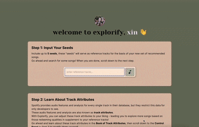
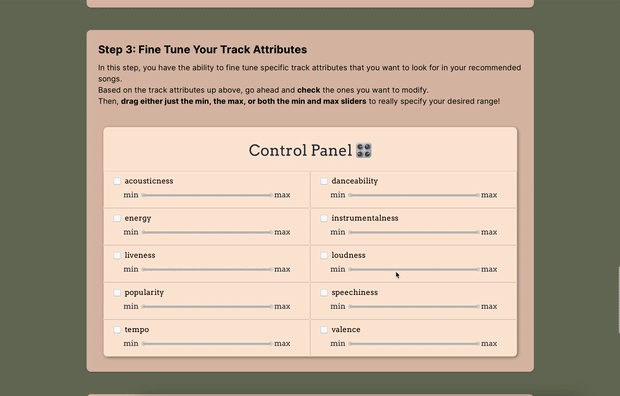
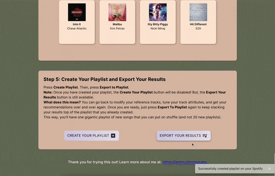

# Explorify

## About 
Spotify provides developers a Recommendation API that can be found here, disguised away from the public audience. Essentially, Explorify aims to unleash the potential of their API. Provided your favorite songs, Explorify aims to recommend you other similar tracks (if there is sufficient information). But, the cool thing is - Spotify's API also allows you to customize your final matches with specific track attributes such as: danceability, energy, popularity, tempo, and more. 

## Demo 
### Step 1: Input Your Songs
Include up to 5 seeds, these "seeds" will serve as reference tracks for the basis of your new set of recommended songs.

### Step 2: Learn About Track Attributes
Spotify provides audio features and analysis for every single track in their database, but they restrict this data for only developers to see. These audio features and analysis are also known as track attributes. With Explorify, you can adjust these track attributes to your liking - leading you to explore more songs based on those redeeming qualities in supplement to your reference tracks!

### Step 3: Fine Tune Your Track Attributes
In this step, you have the ability to fine tune specific track attributes that you want to look for in your recommended songs. Based on the track attributes up above, go ahead and check the ones you want to modify. Then, drag either just the min, the max, or both the min and max sliders to really specify your desired range!

### Steps 4 & 5: Get Your Results, Create Your Playlist, and Export Your Results

